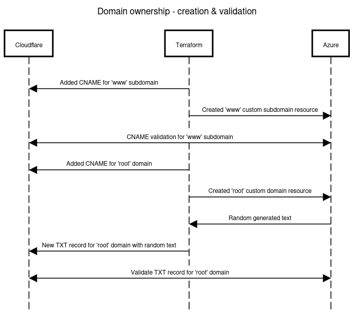

# IaC-schwitzd.me

This repository contains the code to deploy and maintain [my personal](https://www.schwitzd.me/) Hugo website hosted on Azure Static Webapp.

## Summary

The code in this repository is intended to deploy resources to host my static website generated by Hugo on Azure Web Apps with a custom domain. To deploy successfully, I need:

* Terraform installed locally
* Hashicop Vault to store secrets
* Azure CLI installed locally
* Github CLI installed locally
* Hugo installed locally or in a Docker container
* Azure subscription
* Registered domain name on Cloudflare

## Getting started

In this repository there are a lot of references to my website name `schwitzd.me`, you will have to adapt it to make your own website provisioned!

## Terraform

All the resources needed to deploy and maintain my website are deployed with [Terraform](https://www.terraform.io/https://www.terraform.io/).

### Vault

An instance of [Hashicop Vault](https://www.vaultproject.io/) is installed and configured on my local computer, so I decided to store all the secrets needed to provision resources for the site there.
This README assumes that you already have a ready to use instance and that a [kv secret store](https://developer.hashicorp.com/vault/docs/secrets/kv) will be created there.

```bash
# Change directory to iac_vault
cd iac_vault

# Initialize Terraform
terraform init

# Generate execution plan
terraform plan -var-file=variables.tfvars

# Apply configuration
terraform apply -var-file=variables.tfvars

# Display client token
terraform output -raw client_token
```

Store your Vault client secret in a safe place like a password manager.  
The following secrets are manually created in the vault:

* Cloudflare API token
* Cloudflare Zone ID

### State file

At the moment, because we are working on this project myself and I, the state file is stored locally. We are investigating a cool secure place to store it for free in the cloud.

## Cloudflare

I bought my domain by clicking on the [Cloudflare Registrar](https://www.cloudflare.com/products/registrar/) page and then configured the DNS zone with Terrraform. To start, I decided to create two sensitive variables to store the [Cloudflare API token](https://developers.cloudflare.com/fundamentals/api/get-started/create-token/) and the Zone ID.

Your Cloudflare zone ID can be found on the overview page at the bottom left.

|   Type   |   Name   |   Content   |
|:--------:|:--------:|:-----------:|
|  CNAME   | @ | fancy Azure auto-generated domain |
|  CNAME   | www.schwitzd.me | fancy Azure auto-generated domain |
|   TXT    | @ | TXT value for Azure domain validation |

On the Cloudflare DNS records page, you will see a note telling you that CNAME cannot be used for apex zone and why it works with [CNAME flatting](https://developers.cloudflare.com/dns/additional-options/cname-flattening/).

The following process (simplified) explains how the custom domain and subdomain resources are created and validated:



To configure the custom domain, I translated the following documentation as Terraform code: [Set up a custom domain in Azure Static Web Apps](https://learn.microsoft.com/en-us/azure/static-web-apps/custom-domain-external)

## Azure

All Azure resources are provisioned with Terraform, which I created:

* **Resource group** for the personal website
* **Static Web App** where the Hugo site will be hosted
* **Custom domains** to reach my website with a friedly domain name

To authenticate Terrafrom Azure provider, I used the [Azure CLI](https://learn.microsoft.com/en-us/cli/azure/) with the following command:

```bash
az login --use-devide-code
```

## Github

To automatically deploy changes to my website, I created a [Github Actions](https://github.com/features/actions) that uploads the changes to the Azure Static Web App on each `git push`.  
To achieve this automation, a token is required that is generated during the deployment of the Static Web App. Terraform retrieves the token from the Azure API and creates a `github_actions_secret` resource with the value.

To authenticate Terrafrom Github provider, I used the [Azure CLI](https://learn.microsoft.com/en-us/cli/azure/) with the following command:

```bash
gh auth login
```

## To do

* Securely store Terraform state file in the cloud for free

## Inspiration

My repository was inspired by [ned1313/azure-swa-hugo-blog](https://github.com/ned1313/azure-swa-hugo-blog/).
